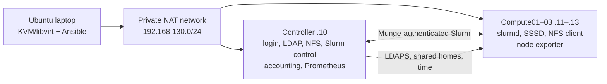

# Mini-HPC Cluster

A laptop-scale HPC platform built from four Ubuntu 24.04 VMs. It combines **KVM/libvirt, Ansible, OpenLDAP/SSSD, NFS, Munge, Slurm accounting and QoS, cgroup v2, environment modules, and Prometheus** into a working three-node compute pool.

**Status:** Deployed and tested locally on 2026-09-28. The [project report](report/final-report.md) separates measured behavior from configured policy and untested limits.

## At a glance

| | Lab configuration |
| --- | --- |
| Host | One Ubuntu laptop; 16 physical cores / 32 SMT threads; about 30 GiB RAM |
| VMs | One 4 GiB controller and three 3 GiB compute nodes; four vCPUs and a 40 GiB thin disk each |
| Network | Private libvirt NAT subnet `192.168.130.0/24`; fixed VM addresses |
| Users and files | LDAPS with SSSD, fixed numeric IDs, shared `/home/hpc` over NFSv4 |
| Jobs | Slurm `slurmctld`/`slurmd`, Munge, `slurmdbd`/MariaDB, QoS, fair-share, cgroup v2 limits |



All VMs share one physical laptop. A compute VM can fail independently, but the controller and laptop are single points of failure. The [architecture and IP inventory](docs/architecture.md) show each VM and the full trust and configuration flow.

## Engineering choices

| Choice | Why it fits this lab | Trade-off |
| --- | --- | --- |
| KVM guests instead of one OS instance | Separate kernels and service managers make node faults, NFS mounts, and cgroup enforcement observable. | VM capacity still contends on one laptop. |
| LDAP/SSSD plus fixed UIDs | One identity source makes the same student own files on every NFS client. | Login and directory service depend on the controller; cached identity has limits. |
| Slurm accounting, QoS, and cgroup v2 | The scheduler can explain *why* a job waits, while the kernel enforces its CPU and RAM allocation. | Accounting adds a database and memory limits can kill an undersized job. |
| Ansible with static CI and live verification | Versioned desired state is reviewable; local checks prove behavior that a hosted runner cannot reach. | Private VM state and secrets need separate backup and live testing. |

The [report's design section](report/final-report.md#design-decisions-and-why-they-fit) compares alternatives and explains these boundaries in detail.

## What was verified

| Test | Observed result | Evidence |
| --- | --- | --- |
| End-to-end student jobs | Both LDAP users ran `srun`; 24 of 24 short CPU jobs completed in 16.230 s | [Services](report/evidence/05-identity-storage-and-scheduler.md), [jobs](report/evidence/06-jobs-and-limits.md) |
| Resource enforcement | One-CPU job saw one allowed CPU; a 400 MiB allocation in a 128 MiB job was killed by the memory cgroup | [Job and limit tests](report/evidence/06-jobs-and-limits.md) |
| Queue and QoS | Three exclusive jobs occupied three nodes; a fourth waited for `Resources`. QoS wall-time and per-user concurrency limits also held jobs pending | [Queue tests](report/evidence/06-jobs-and-limits.md) |
| Recovery | Drained compute03 returned to `idle` in 11.620 s; an NFS write succeeded 7.313 s after the export restarted | [Failure tests](report/evidence/07-failure-injection.md) |
| Repeatability | Final full Ansible replay: 35.76 s and `changed=0 failed=0` on all four VMs; file and QoS drift were detected and corrected | [Drift and timing](report/evidence/08-drift.md) |

These are observations from one shared laptop, with SSH/Ansible and polling time included. They are not a CPU speedup or high-availability claim. The [full report](report/final-report.md) explains the method and limitations.

## Explore the project

| Start here | Purpose |
| --- | --- |
| [Five-minute demo](docs/demo.md) | Show the running cluster and explain a job from submission to accounting. |
| [Architecture](docs/architecture.md) | Diagram, IP/role inventory, trust flow, and failure domains. |
| [Scheduler policy](docs/scheduler-policy.md) | Partitions, QoS, fair-share, and cgroup settings. |
| [Learning guide](docs/learning-guide.md) | Why each component exists and what breaks when it fails. |
| [Project report](report/final-report.md) | Design trade-offs, measured results, evidence, and limits. |
| [Administrator runbook](docs/admin-runbook.md) · [user quick-start](docs/user-quickstart.md) · [handover](docs/handover.md) | Deployment, use, diagnosis, and operational ownership. |

The implementation is grouped by responsibility: [`infrastructure/`](infrastructure) defines the network and pinned cloud image; [`ansible/`](ansible) holds inventory, roles, and the ordered site playbook; [`workloads/`](workloads) provides CPU examples; [`scripts/`](scripts) handles bootstrap and measurement; [`.github/workflows/`](.github/workflows) validates scripts and Ansible syntax on push or pull request.

## Reproduce and validate

Follow the [administrator runbook](docs/admin-runbook.md) for host packages, libvirt networking, VM creation, private secrets, and **verified SSH host keys**. On a prepared laptop, from the repository root:

```bash
ansible-galaxy collection install -r ansible/collections/requirements.yml
scripts/check-static.sh
ansible-playbook ansible/playbooks/site.yml
ansible-playbook ansible/playbooks/verify-cluster.yml
```

The static check runs without VMs or lab secrets. The live verifier checks identity, NFS, daemons, Slurm registration, and all four monitoring targets. The [sample `sbatch` and `srun` commands](docs/user-quickstart.md) run as an LDAP user through the controller.

**Scope:** This lab does not establish multi-host availability, MPI behavior, host SMT speedup, or a fresh-image end-to-end provisioning time. The [report](report/final-report.md#limits-and-next-study) records what would need a separate experiment. Local secrets and VM images are ignored by Git and must be backed up privately for a deployed-cluster restore.
