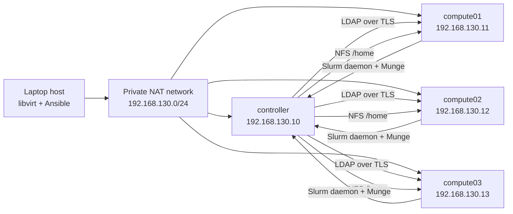

# Mini-HPC cluster architecture

## Scope and topology

This is a four-VM teaching cluster on one Ubuntu laptop. KVM/libvirt provides
separate guest kernels so that systemd services, NFS mounts, node failures and
Slurm cgroup enforcement behave like a small Linux cluster. All VMs remain on
the same physical host; this is not high availability.

| Role | Hostname | Planned IPv4 | vCPUs | RAM | Virtual disk | Services |
| --- | --- | --- | ---: | ---: | ---: | --- |
| Controller | `controller` | `192.168.130.10` | 4 | 4 GiB | 40 GiB | `slurmctld`, `slurmdbd`, MariaDB, OpenLDAP, SSSD, NFS, monitoring server |
| Compute | `compute01` | `192.168.130.11` | 4 | 3 GiB | 40 GiB | `slurmd`, SSSD, NFS client, monitoring agent |
| Compute | `compute02` | `192.168.130.12` | 4 | 3 GiB | 40 GiB | `slurmd`, SSSD, NFS client, monitoring agent |
| Compute | `compute03` | `192.168.130.13` | 4 | 3 GiB | 40 GiB | `slurmd`, SSSD, NFS client, monitoring agent |

The address plan will be checked against active host routes again at deployment.
Fixed libvirt DHCP leases will associate VM MAC addresses with these IPs. The
40 GiB virtual disks can be thin-provisioned; actual host disk use must still
be monitored. Guest RAM totals 13 GiB, leaving headroom on this 30 GiB host.

## Configuration and trust flow

Ansible runs on the laptop and pushes the versioned desired state over SSH to
each VM. Each node receives its own service configuration and the common Slurm
configuration. A single Munge key must be shared by Slurm nodes but stored
outside Git. Database credentials also stay outside Git.

OpenLDAP on the controller is the source of user and group identities. SSSD on
all four VMs resolves those identities and authenticates users. Ansible manages
the directory entries and each client's SSSD configuration. LDAP transport uses
TLS with a lab CA trusted by every VM; CA and server private keys and user
passwords stay outside Git. Local service accounts and a local administrator
remain available for recovery when the directory is unavailable.

The controller exports `/home` over NFS. Shared numeric user and group IDs
are required so file ownership means the same thing on every node. Jobs run on
compute VMs; users submit through the controller. Slurm accounting and policy
are stored through `slurmdbd` in MariaDB on the controller.

## Failure domains and limits

* Loss of `compute01`, `compute02`, or `compute03` removes that node's capacity;
  other compute nodes can still accept jobs.
* Loss of the controller stops scheduling and removes the NFS export,
  accounting service and central directory. SSSD may answer cached identity
  lookups for a time; new authentication and existing jobs may behave
  differently depending on cache and file access. Failure tests will record
  the observed behavior.
* Loss of the laptop stops the whole cluster. No VM-level design can remove
  that physical failure domain.
* The shared laptop CPU, memory, storage and thermal limits can affect all VM
  measurements. Benchmark reports must include host load and test conditions.

This lab does not teach high availability, Kerberos/FreeIPA, production identity
security, or multi-host network and storage performance. Those require a larger
topology.
