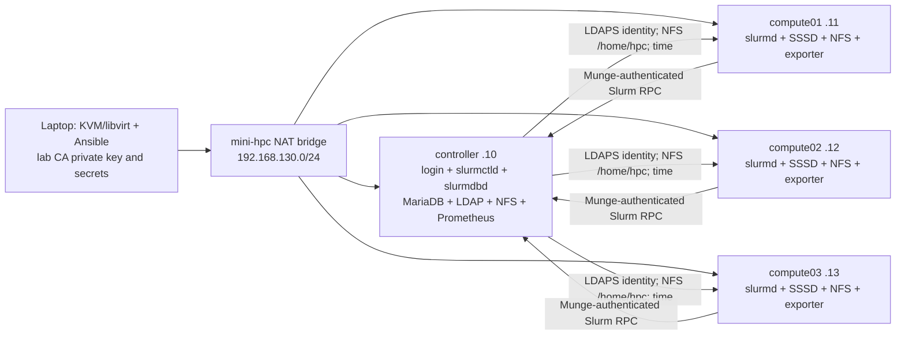

# Mini-HPC cluster architecture

## Goal and physical boundary

Four Ubuntu 24.04 guests on one laptop make Linux services and scheduler behavior reproducible without pretending to offer high availability. The host has 16 physical cores, 32 logical CPUs with SMT, and about 30 GiB RAM. Each guest exposes one socket with four vCPUs and one thread per virtual core. The 16 total guest vCPUs share the laptop's physical cores; guest topology does not reveal the host's SMT allocation. Guest RAM totals 13 GiB. The 40 GiB qcow2 disks are thin provisioned, so host free space remains a shared constraint.

| Role | Hostname | IPv4 | vCPUs | RAM | Disk | Main services |
| --- | --- | --- | ---: | ---: | ---: | --- |
| Login/controller | `controller.mini-hpc.test` | `192.168.130.10` | 4 | 4 GiB | 40 GiB | `slurmctld`, `slurmdbd`, MariaDB, OpenLDAP, SSSD, NFS, Chrony, Prometheus |
| Compute | `compute01.mini-hpc.test` | `192.168.130.11` | 4 | 3 GiB | 40 GiB | `slurmd`, SSSD, NFS client, timesyncd, node exporter |
| Compute | `compute02.mini-hpc.test` | `192.168.130.12` | 4 | 3 GiB | 40 GiB | Same |
| Compute | `compute03.mini-hpc.test` | `192.168.130.13` | 4 | 3 GiB | 40 GiB | Same |

The libvirt network has fixed DHCP leases keyed to VM MAC addresses. Ansible renders the same address map to `/etc/hosts` and cloud-init's host template on every guest. This avoids a lab DNS server but makes an inventory address change a cluster-wide deployment. The controller is the user login host; jobs execute on compute nodes only.

## Configuration and trust

Ansible pushes versioned configuration from the laptop over pinned SSH host keys. `ansible/playbooks/site.yml` orders base names and time, LDAPS/SSSD, NFS, Munge, accounting, Slurm, modules, and monitoring. Reapplying it checks and reconciles drift. A single Munge key authenticates Slurm messages across nodes. The local `slurm` service UID/GID is fixed at 64030; LDAP student UIDs and group GID are fixed at 20001/20002 and 20000 so NFS ownership is consistent.

The laptop generates the lab CA and stores its private key, Munge key, SSH key, database password, and LDAP passwords in Git-ignored `secrets/`. Only the public CA certificate is distributed to all guests. The controller gets a CA-signed server certificate and key for LDAPS. SSSD validates the controller certificate with `ldap_tls_reqcert=demand` and caches credentials. LDAP is the identity source; SSSD is each host's resolver and PAM client. Munge authenticates Slurm services; it does not log users in. NFS moves files; it does not authenticate users independently of their numeric IDs.

The controller exports only `/home/hpc` to `192.168.130.0/24` using `root_squash`. Compute guests use a hard NFSv4 automount. A server outage therefore can block file I/O until recovery, even while Slurm and cached identity lookups remain available. The controller uses Chrony to serve time to compute guests, which poll it with systemd-timesyncd. Clock skew matters to time-limited Munge credentials.

Slurm uses `select/cons_tres` with core and memory allocations, cgroup v2 to constrain CPU and RAM, and `slurmdbd` backed by local MariaDB for accounting, QoS, and fair-share. Two overlapping partitions (`short`, `batch`) expose the same three nodes with different wall-time ceilings. The controller's Prometheus scrapes node exporters every 15 seconds. See [scheduler policy](scheduler-policy.md) for exact limits.

## Failure domains

- One compute guest fails: its four vCPUs disappear; other nodes can still run jobs. An administrator drains and resumes it around repair.
- The controller fails: submissions and new scheduling stop; LDAP, accounting, NFS, and monitoring also disappear. Running compute work may continue until it needs a controller or shared file. Cached SSSD data may help identity lookups, but this is not an availability guarantee.
- The laptop, bridge, or host storage fails: all four VMs are affected. No guest-level redundancy removes this physical failure domain.
- The lab CA, Munge key, fixed UIDs, and inventory host map are cluster-wide configuration dependencies. Rotate or change them as a coordinated operation.

This project does not measure host SMT on versus off, NUMA placement, multi-host network latency, NFS throughput, or production identity and high availability. Those require a different test setup. See [the measured report](../report/final-report.md) for the tested behaviors and limits.
